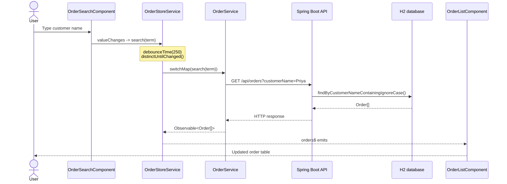
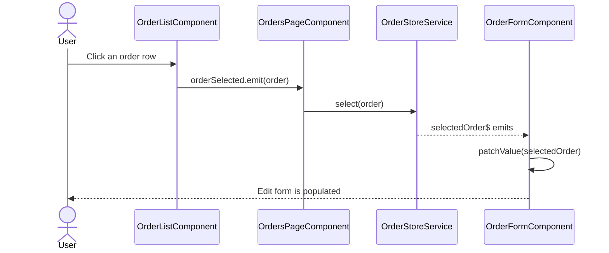
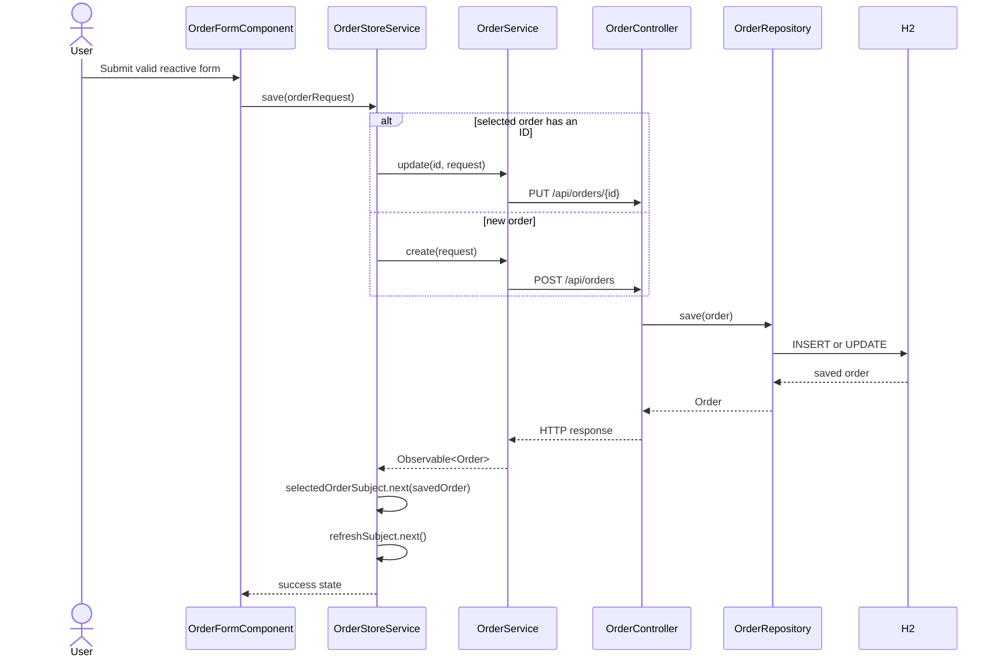

# Angular Order CRUD Interview Guide

This guide explains the current Angular 17 + Spring Boot Order feature: component architecture, parent-child communication, sibling coordination, RxJS search, reactive forms, and the complete UI-to-database flow.

## 1. Architecture

When the user navigates to `/orders`, Angular renders the parent workspace and its child components together.

```mermaid
flowchart TB
    Shell[AppComponent<br/>router-outlet] -->|route /orders| Parent[OrdersPageComponent<br/>parent workspace]
    Parent --> Search[OrderSearchComponent<br/>reactive FormControl]
    Parent --> List[OrderListComponent<br/>@Input orders]
    Parent --> Form[OrderFormComponent<br/>reactive FormGroup]
    Search -. sibling command .-> Store[OrderStoreService<br/>BehaviorSubject + RxJS]
    List -->|@Output orderSelected| Parent
    Parent -->|select(order)| Store
    Form -. save/delete .-> Store
    Store --> Service[OrderService<br/>HttpClient]
    Service --> Controller[OrderController<br/>Spring Boot REST]
    Controller --> Repository[OrderRepository<br/>Spring Data JPA]
    Repository --> H2[(H2 database)]
```

### Main responsibilities

| Layer | Responsibility |
| --- | --- |
| `AppComponent` | Application shell, navigation, and `router-outlet` |
| `OrdersPageComponent` | Parent layout and coordination of child components |
| `OrderSearchComponent` | Reactive search input and search command |
| `OrderListComponent` | Displays orders and emits the selected order |
| `OrderFormComponent` | Reactive create, update, and delete form |
| `OrderStoreService` | Shared RxJS state and sibling coordination |
| `OrderService` | HTTP calls to the backend |
| `OrderController` | REST API endpoints |
| `OrderRepository` | JPA persistence and database search |

### Parent template

```html
<app-order-search></app-order-search>

<app-order-list
  [orders]="(orders$ | async) ?? []"
  (orderSelected)="onOrderSelected($event)">
</app-order-list>

<app-order-form
  [selectedOrder]="selectedOrder$ | async">
</app-order-form>
```

The `AppModule` declares the components and imports `ReactiveFormsModule` and `HttpClientModule`. The route is configured as:

```ts
{ path: 'orders', component: OrdersPageComponent }
```

## 2. Parent, Child, and Sibling Relationships

### Parent-to-child with `@Input()`

`OrdersPageComponent` passes data down to its children:

```html
<app-order-list [orders]="(orders$ | async) ?? []"></app-order-list>
<app-order-form [selectedOrder]="selectedOrder$ | async"></app-order-form>
```

`OrderFormComponent` receives the selected order:

```ts
@Input() selectedOrder: Order | null = null;
```

When the selected order changes, the form patches its controls:

```ts
ngOnChanges(changes: SimpleChanges): void {
  if (changes['selectedOrder']) {
    if (this.selectedOrder) {
      this.orderForm.patchValue(this.selectedOrder);
    } else {
      this.resetForm();
    }
  }
}
```

### Child-to-parent with `@Output()`

`OrderListComponent` emits a selected order to its parent:

```ts
import { Component, EventEmitter, Input, Output } from '@angular/core';

@Input() orders: Order[] = [];
@Output() orderSelected = new EventEmitter<Order>();

selectOrder(order: Order): void {
  this.orderSelected.emit(order);
}
```

The parent handles the event and updates the shared store:

```ts
onOrderSelected(order: Order): void {
  this.orderStore.select(order);
}
```

Template binding:

```html
<app-order-list
  [orders]="(orders$ | async) ?? []"
  (orderSelected)="onOrderSelected($event)">
</app-order-list>
```

### Sibling communication

`OrderSearchComponent`, `OrderListComponent`, and `OrderFormComponent` are siblings. They do not call one another directly. They coordinate through `OrderStoreService`:

```mermaid
flowchart LR
    Search[OrderSearchComponent] -->|search(term)| Store[OrderStoreService]
    List[OrderListComponent] -->|@Output to parent| Parent[OrdersPageComponent]
    Parent -->|select(order)| Store
    Form[OrderFormComponent] -->|save / delete| Store
    Store -->|orders$| List
    Store -->|selectedOrder$| Form
```

This keeps the siblings loosely coupled and gives the application one shared state boundary.

## 3. Sequence Diagram

### Customer search flow



### Selection flow with `@Output()`



## 4. Tree Architecture

```text
AppComponent
└── router-outlet
    └── OrdersPageComponent (parent, /orders)
        ├── OrderSearchComponent (sibling A)
        │   └── FormControl -> search(term)
        ├── OrderListComponent (sibling B)
        │   ├── @Input() orders
        │   └── @Output() orderSelected
        └── OrderFormComponent (sibling C)
            ├── @Input() selectedOrder
            └── FormGroup -> save/delete

All three siblings use:
└── OrderStoreService
    └── OrderService -> OrderController -> OrderRepository -> H2
```

### Relationship tags

- **Parent:** `OrdersPageComponent` renders the child selectors.
- **Input:** `orders` and `selectedOrder` flow from parent to child.
- **Output:** `orderSelected` flows from `OrderListComponent` to the parent.
- **Sibling relation:** Search, list, and form communicate through `OrderStoreService`.
- **Persistence:** `OrderService` calls the REST controller, which uses JPA.

## 5. RxJS and Reactive Forms

### Search pipeline

```ts
readonly searchControl = new FormControl('', {
  nonNullable: true
});

constructor(private orderStore: OrderStoreService) {
  this.searchControl.valueChanges.subscribe((term) => {
    this.orderStore.search(term);
  });
}
```

The store processes the search stream:

```ts
readonly orders$: Observable<Order[]> = this.refreshSubject.pipe(
  startWith(void 0),
  switchMap(() => this.searchTermSubject.pipe(
    debounceTime(250),
    distinctUntilChanged(),
    switchMap((term) => this.orderService.search(term)),
    catchError(() => {
      this.errorSubject.next('Unable to load orders.');
      return [[]];
    })
  )),
  tap(() => this.errorSubject.next(null)),
  shareReplay({ bufferSize: 1, refCount: true })
);
```

- `BehaviorSubject` stores the current search term and selected order.
- `Subject` triggers a refresh after create, update, or delete.
- `debounceTime(250)` waits for typing to pause.
- `distinctUntilChanged()` ignores duplicate searches.
- `switchMap()` keeps the latest request active.
- `shareReplay()` shares the latest result with subscribers.
- The `async` pipe subscribes to `orders$` in the template.

### Reactive CRUD form

```ts
readonly orderForm = this.formBuilder.nonNullable.group({
  customerName: ['', [Validators.required, Validators.minLength(2)]],
  product: ['', Validators.required],
  quantity: [1, [Validators.required, Validators.min(1)]],
  totalAmount: [0, [Validators.required, Validators.min(0)]],
  status: ['NEW' as OrderStatus, Validators.required]
});
```

Submit validation and save:

```ts
submit(): void {
  if (this.orderForm.invalid) {
    this.orderForm.markAllAsTouched();
    return;
  }

  const request: OrderRequest = this.orderForm.getRawValue();
  this.orderStore.save(request).subscribe();
}
```

## 6. CRUD and Backend Flow



### REST endpoints

| Method | Endpoint | Purpose |
| --- | --- | --- |
| `GET` | `/api/orders` | Retrieve all orders |
| `GET` | `/api/orders?customerName=Priya` | Search orders by customer |
| `GET` | `/api/orders/{id}` | Retrieve one order |
| `POST` | `/api/orders` | Create an order |
| `PUT` | `/api/orders/{id}` | Update an order |
| `DELETE` | `/api/orders/{id}` | Delete an order |

### Spring Boot controller example

```java
@GetMapping
public ResponseEntity<List<Order>> getAllOrders(
    @RequestParam(required = false, defaultValue = "") String customerName) {
  List<Order> orders = customerName.isBlank()
      ? orderRepository.findAll()
      : orderRepository.findByCustomerNameContainingIgnoreCase(customerName);

  return ResponseEntity.ok(orders);
}

@PostMapping
public ResponseEntity<Order> createOrder(@RequestBody Order order) {
  Order savedOrder = orderRepository.save(order);
  return ResponseEntity.status(HttpStatus.CREATED).body(savedOrder);
}
```

### Backend layers

- `Order.java`: JPA entity with customer, product, quantity, total amount, and status.
- `OrderRepository.java`: `JpaRepository<Order, Long>` plus customer-name search.
- `OrderController.java`: REST mappings and HTTP responses.
- H2: local persistence database.

## Interview Summary

A concise interview answer:

> “The `/orders` route loads `OrdersPageComponent`, which renders search, list, and form child components on the same screen. The parent passes data down with `@Input()`. The list sends the selected order back with `@Output()`, and the parent updates the shared `OrderStoreService`. The sibling components use RxJS streams rather than calling one another directly. The reactive form validates the request, `OrderService` sends it through `HttpClient`, and Spring Boot maps the request to `OrderController`, `OrderRepository`, and the H2 database.”
